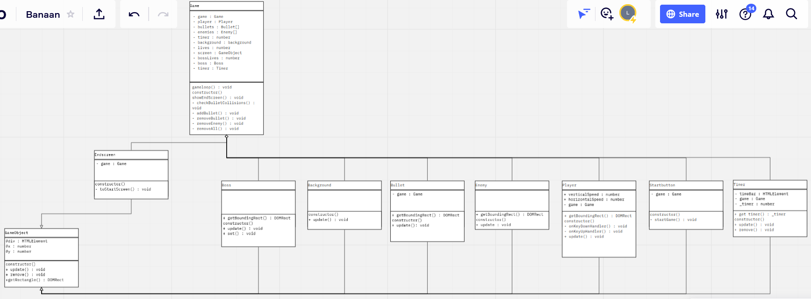
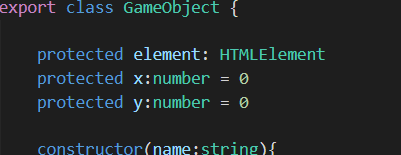
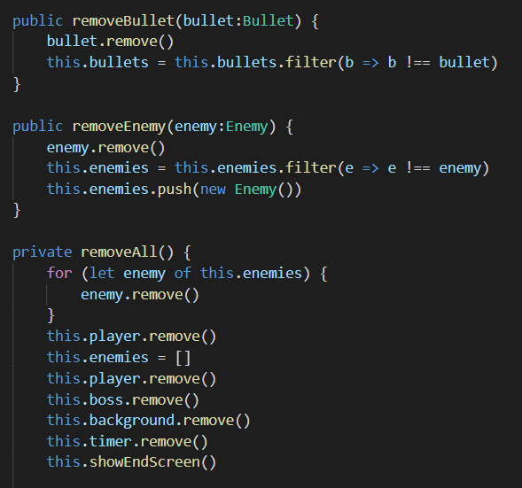
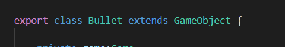

# PRG04 HERKANSING eindopdracht 

Wanneer je volledige eindcijfer (klassendiagram + afgeronde eindopdracht) een onvoldoende is kan je het hele project herkansen. 

- [Kies een nieuwe startopdracht met uniek thema en game mechanic in de gaminator](https://hr-cmgt.github.io/gaminator/) 
- Bedenk hiermee een nieuw game concept. 
- Maak een **nieuw klassendiagram**. 
- **Bouw je nieuwe game** in Object Oriented Typescript.
- Vul dit inleverdocument helemaal in

## Deadline: 23 augustus

**De deadline voor het inleveren van de game is Maandag 23 augustus om 10:00 (week 0).**

⚠️ Je werk wordt **beoordeeld volgens de cursushandleiding**. Lees dit nog even goed door voordat je je project inlevert.

---

 
 
 

# Klassendiagram

Plaats je klassendiagram als PNG bestand. Dat kan je doen met een image tag:

Als deze image niet goed leesbaar is is het handig om hem te downloaden zodat er ingezoomd kan worden.

 
 
 

# Game

Mijn nieuwe thema uit de [gaminator](https://hr-cmgt.github.io/gaminator/) is: Fantasy, Fight, Monsters

Toelichting gameplay:

Je speelt als soldaatje in een land geinfesteerd door monsters. Jouw doel is simpel: overleven. Je moet de skeletten zien te ontwijken (dit kan zowel door bewegen als schieten met de spatiebalk) om zo uiteindelijk de eindbaas te verslaan. Deze heeft 5 levens, en beweegt op en neer om het moeilijker te maken. Jij als soldaat hebt 3 levens, en zal dus niet veel hits overleven.

## Encapsulation

Encapsulation- In al je classes is encapsulation benoemd. Het is minimaal 1x gelukt om een getter en/of setter toe te passen en er ook gebruik van te maken. Deze toepassing heeft nut voor de uitwerking van je game.-Je legt dit goed uit in je inleverdocument.

Alle private properties zijn alleen in de class waar ze gemaakt zijn toegankelijk. Public properties zijn ook toegankelijk in andere classes, en protected alleen in de children. In mijn GameObject is alles protected, zodat al de variabelen daarin alleen toegankelijk zijn in de children. Functies zoals de DOMRectangle en de update functie zijn natuurlijk public, omdat die ook in andere classes toegankelijk moeten zijn. Het is me deze keer wel gelukt om een getter / setter toe te voegen: de timer heeft er een!

## Composition

Composition-Je hebt composition op een nuttige manier toegepast in je game. -Je legt dit goed uit in je inleverdocument.

Ik heb overal in mijn bestand waar het kon gebruik gemaakt van composition. Een aantal goede voorbeelden hiervan zijn de removeAll() functie in de gamescreen, of de keyhandlers in de player.ts.

## Inheritance

Inheritance-In je game heb je minimaal 1 x op een juiste wijze overerving toegepast. Deze toepassing heeft nut voor de uitwerking van je game-Je legt dit goed uit in je inleverdocument.

Ik heb in veel plekken van mijn game Inheritance toegepast. Bijna al mijn classes hebben een overerving van GameObject, zodat ze allemaal een x en y hebben, een update en remove functie, en een DOMRectangle. Dit bespaart extra lines code, en is daarom zeer handig.

## Game development technieken

Game development techieken-Je hebt alle 6 basis game development techieken toegepast in je game: HTML+CSS Basics, Game Loop, Collision Detection, Besturing, Timer, Object pool.-Je benoemt elk punt kort en duidelijk in je inleverdocument.

Ik heb alle zes de technieken toegepast! Een voorbeeld van HTML/CSS is de index en het style bestand. De Game Loop staat in de game.ts en wordt gebruikt om de volledige game te laten draaien. Zonder Collision detection was mijn game niet werkend, want dan zouden de enemies niks kunnen. Besturing staat in de player.ts, en wordt gebruikt om de speler over het scherm te bewegen. De Timer wordt ook gebruikt om af te tellen tot het moment dat de boss mag verschijnen. Verder is er ook nog de GameObject, dus de object pool is ook gebruikt!